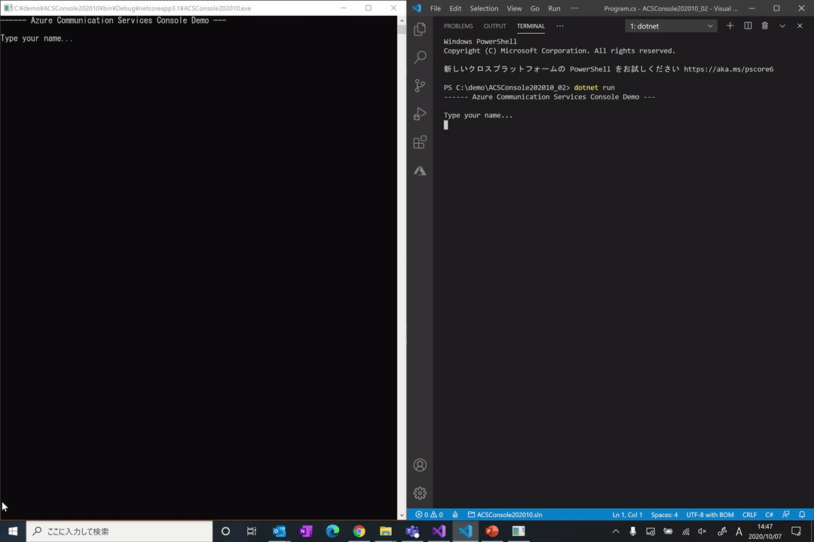

# AzCommSrvsDemo202010
## Azure Communication Services Demo (Sample Codes)

Sample demo apps using [Azure Communication Services](https://azure.microsoft.com/en-us/services/communication-services/).

[Azure Communication Services](https://azure.microsoft.com/ja-jp/services/communication-services/) を利用したサンプルアプリです。

- Sample Demo Apps
    - ACSConsole (C#)
        - Azure Communication Services に接続してユーザー (CommunicationUser) を作成、スレッド (ChatThread) を通じてメッセージの送受信ができるコンソールアプリです。2 つ同時に起動させると (Master および Member)、Master が作成するスレッドに Member のユーザーを追加し、メッセージをやり取りすることが可能です。
        - Console app to create user (CommunicationUser) and send & get messages through thread (ChatThread) through Azure Communication Services. Running 2 consoles at same time (as Master and Member), able to add Member user to Master's thread and communicate each other.
    - ACSCallWeb (node.js)
        - Azure Communication Services 接続してユーザー (CommunicationUser) を作成、VoIP 通話を行うことができる Web アプリです。通話テストでは、Azure Communication Services 通話テスト用ユーザー (id: **8:echo123**) が利用できます。
        - Web app to create user (CommunicationUser) and make VoIP call through Azure Communication Services. Please use Azure Communication Services calling test user (id: **8:echo123**).

- Requirements
    - Azure サブスクリプション & Azure Communication Services サービス
        - Azure Portal から Azure Communication Services の接続文字列(Connection String) と エンドポイント(URL) を取得し、アプリ内の 接続文字列 および エンドポイント を書き換えてください
    - Azure Subscription & Azure Communication Services
        - Get Connection String and endpoint (URL) from Azure Portal. Replace connection string and endpoint in apps.

- Demo
    - ACSConsole
        - 
    - ACSCallWeb
        - 